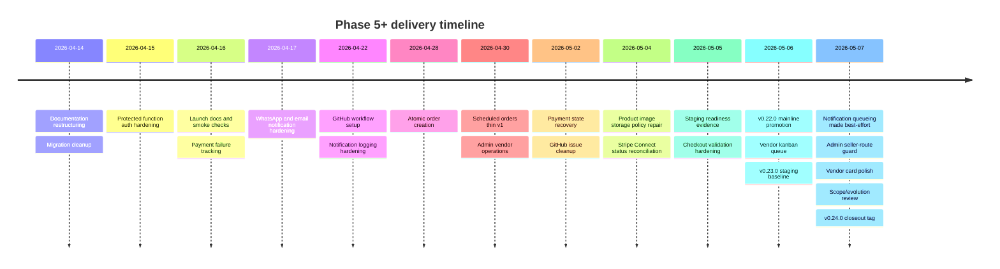
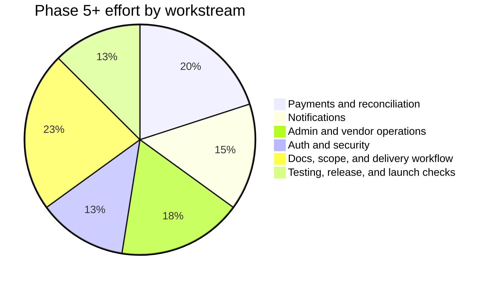

# Phase 5+ Client Recap

Period covered: April 14, 2026 to May 7, 2026

## Summary

Phase 5+ moved SKIIP from a working pilot build into a stronger closed-pilot operational baseline. The work has not only added visible product polish; it has also improved the parts of the system that matter most for real event use: safer payments, stronger order creation, clearer vendor and admin operations, durable notifications, better delivery tracking, and more honest launch documentation.

The largest shift since the first May 2 recap is that the launch-readiness picture is now much clearer. Staging has advanced to `v0.24.0`, the vendor queue has been upgraded for kitchen operations, checkout and auth edge cases have been tightened, notification queueing failures no longer make successful business actions look failed, and the project now has a clearer scope/evolution narrative for client conversations.

## Progress Timeline

## What Improved

| Area | Client-facing outcome |
| :--- | :--- |
| Payments | Stronger Stripe webhook recovery, multi-secret webhook support, admin reconciliation, refund tooling, Connect status repair, and clearer remaining payout/refund rehearsal gates. |
| Checkout | Inventory and Edge Function validation failures now surface as clearer buyer-facing errors instead of generic failure states. |
| Vendor operations | Vendors now have a kanban-style active kitchen queue, scheduled/all-order filtering, clearer order cards, and a more usable paid-order lifecycle. |
| Admin operations | Admin vendor management, refunds, reconciliation, and dashboard visibility have stronger operator paths and clearer launch caveats. |
| Notifications | Email/WhatsApp delivery is backed by durable logs, provider webhooks, and best-effort post-mutation queueing so optional notification failures do not undo successful order/refund state. |
| Auth and access | Protected function behavior, buyer/vendor/admin routing, seller route boundaries, and RLS/auth launch sign-off are documented and better tracked. |
| Delivery management | GitHub issues, milestones, labels, release versions, branch rules, project documentation, and phase/scope framing are materially cleaner. |
| Testing | The local baseline has grown from 22 to 35 unit tests, with public Playwright smoke checks still passing and authenticated smoke checks still credential-gated. |

## Workstream Coverage

## Current Launch Position

SKIIP is now best described as a strong closed-pilot MVP / first operational baseline. The core buyer -> Stripe -> vendor -> admin loop is workable and better supported than it was at the start of Phase 5, but the product should still not be described as fully open-launch ready.

Remaining launch work is now concentrated into a smaller, clearer set of gates:

- environment and secret parity across Vercel, Supabase, Stripe, Resend, and Twilio
- one complete Stripe payment, payout, refund, and reconciliation rehearsal with a Stripe-onboarded seller
- notification provider setup, webhook verification, and retry/backlog ownership
- authenticated Playwright smoke tests with stable buyer, seller, and admin credentials
- backend boundary hardening and final live-environment sign-off
- decision on whether marketing lead capture remains out of launch scope or becomes operational

## Scope Position

The current platform is more than a basic MVP page build. Phase 5 added substantial behind-the-scenes work around payments, inventory protection, refunds, reconciliation, notifications, auditability, release discipline, and operations. Those improvements make the product safer and more supportable.

At the same time, final launch activation and future expansion should stay separate:

- **Phase 6:** live provider setup, environment parity, payment/refund/payout rehearsal, auth/RLS sign-off, notification verification, authenticated smoke checks, and event support planning.
- **Phase 7 and beyond:** QR collection/scanning, deeper event management, advanced analytics beyond launch telemetry, fuller multi-event operations, production-grade marketing lead capture, and larger UI/product expansion.
