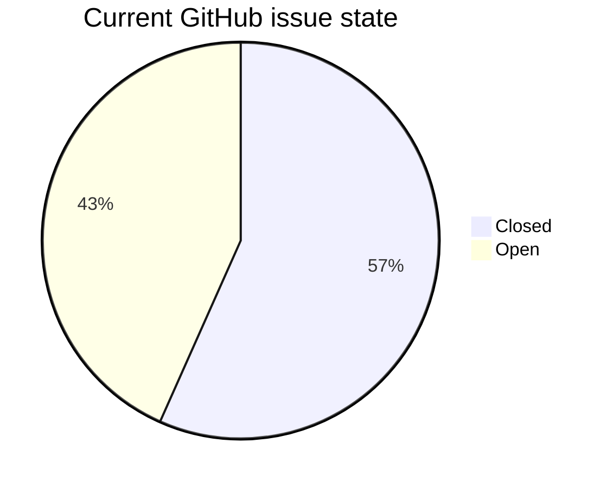
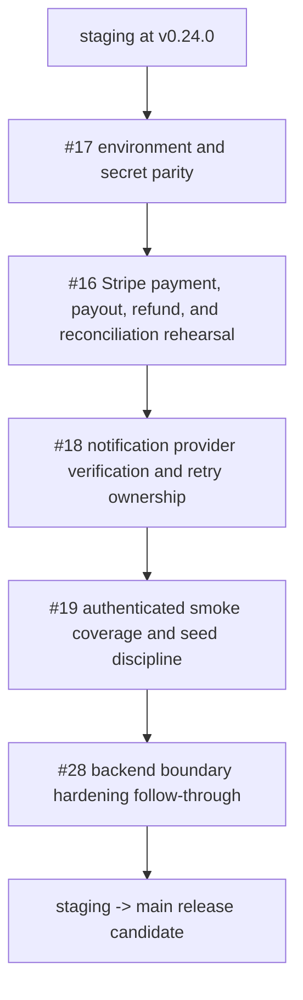

# Phase 5+ Internal Delivery Report

Period covered: April 14, 2026 to May 7, 2026

## Summary

Phase 5+ hardened the closed-pilot baseline across payments, order creation, admin/vendor operations, notifications, documentation, delivery hygiene, release discipline, and client-facing scope clarity. Current `staging` is locally clean and aligned with `origin/staging` at `be5ae14`.

The May 2 report stopped at payment state recovery. Since then, Phase 5+ also added product image storage policy repair, Stripe Connect onboarding-status reconciliation, structured checkout errors, staging-origin allow-listing, a May 2026 project assessment, release/version synchronization through `0.24.0`, the vendor kanban queue, best-effort notification queueing, an admin seller-route guard, vendor order-card polish, and scope/evolution documentation.

## Delivery Snapshot

| Metric | Current value |
| :--- | :--- |
| Branch reviewed | `staging` |
| Current head | `be5ae14 docs: add project evolution review document detailing platform growth and phase history` |
| Current version | `0.24.0` |
| Commits ahead of `main` | 10 commits |
| Phase 5+ commits since April 14 | 58 commits |
| GitHub issues checked | 30 issues |
| Closed issues | 17 |
| Open issues | 13 |
| Open P0 issues | 2: `#16`, `#17` |
| Local worktree before this docs change | clean |

## Recent Commits Since The May 2 Report

```text
be5ae14 - 2026-05-07 : docs: add project evolution review document detailing platform growth and phase history
8794d0d - 2026-05-07 : feat(vendor): polish order queue cards
c161fa0 - 2026-05-07 : fix(checkout): surface Edge Function validation errors
6104e86 - 2026-05-07 : fix(auth): prevent admins entering seller routes
d61ed12 - 2026-05-07 : fix(notifications): make post-mutation queueing best-effort
bf48d07 - 2026-05-06 : docs(scope): add project evolution and scope reviews
da612d7 - 2026-05-06 : docs(delivery): record closeout progress and issue hygiene
63bb3af - 2026-05-06 : chore(release): sync staging baseline to 0.23.0
71d3bb0 - 2026-05-06 : feat(vendor): add kanban order queue
1e96f97 - 2026-05-06 : feat(vendor): add kanban order queue
7786b05 - 2026-05-06 : chore(release): bump version to 0.22.0
214e835 - 2026-05-05 : docs: capture May 2026 project assessment
8cb0117 - 2026-05-05 : fix(supabase): include staging origin in function allow-list
ac2a7c7 - 2026-05-05 : fix(orders): return structured checkout inventory errors
3511c89 - 2026-05-04 : fix(payments): reconcile Stripe Connect onboarding status
6742827 - 2026-05-04 : chore(release): bump version to 0.21.0
1238403 - 2026-05-04 : test(smoke): align login selector and fixture notes
5922429 - 2026-05-04 : fix(supabase): repair product image storage policies
4b098ac - 2026-05-04 : docs(progress): record docs strategy planning
```

## Issue Snapshot



| Status | Issues |
| :--- | :--- |
| Closed since/through Phase 5+ | `#14`, `#15`, `#20`, `#22`, `#23`, `#24`, `#25`, `#27`, `#29`, `#32`, `#33`, `#34`, `#37`, `#38`, `#42`, `#43`, `#45` |
| Open launch P0 | `#16`, `#17` |
| Open launch / closeout P1 | `#18`, `#19`, `#28`, `#39`, `#46`, `#47`, `#48` |
| Open P2 / docs / future planning | `#26`, `#35`, `#36`, `#41` |

Recent issue movement worth noting:

- `#43` vendor kanban queue is closed.
- `#42` vendor order card/detail polish is closed.
- `#45` notification side-effect hardening is closed.
- `#14` edge-function auth posture and `#15` RLS/role boundary work are no longer open P0s, but backend hardening remains tracked through `#28`.
- `#16` and `#17` remain the two open P0 launch gates.

## Verification Baseline

| Check | Latest recorded result |
| :--- | :--- |
| `npm run lint` | Passed on May 6 closeout pass |
| `npm run test` | Passed, 35 tests |
| `npm run build` | Passed |
| `npm run test:e2e` | Passed 3 public smoke tests; 3 authenticated smoke tests skipped without credentials |
| `npm audit --audit-level=moderate` | Passed, 0 vulnerabilities on May 6 |
| `deno check supabase/functions/tests/notifications-best-effort-test.ts` | Passed during notification queueing hardening |
| Deno notification tests | Type-check/no-run passed locally; full Windows Deno test run panicked after type-checking, so Ubuntu CI remains the authoritative runner |

## Mainline Readiness

Do not treat the current repo as fully launch-ready until these gates are closed:



Secondary cleanup and planning:

- `#39`: verify admin refund flow against Stripe test mode and app state.
- `#46`: plan beta-to-production readiness hardening.
- `#47`: fix Supabase database linter security warnings.
- `#48`: resolve GitHub dependency security and quality alerts.
- `#26`: decide whether marketing lead capture is operational scope or explicitly deferred.
- `#41`: plan app-wide UI/UX overhaul after launch-critical work.

## Delivery Interpretation

The codebase now supports a strong closed-pilot operational baseline. The remaining work is less about broad feature invention and more about live-environment proof: provider setup, payment/reconciliation rehearsals, authenticated smoke coverage, notification recovery ownership, and support readiness.

The scope/evolution docs added on May 6-7 should be used in client conversations to separate:

- delivered MVP and Phase 5 hardening value
- Phase 6 launch activation and live-provider verification
- Phase 7+ future product expansion
