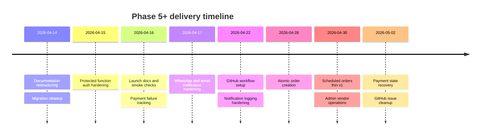
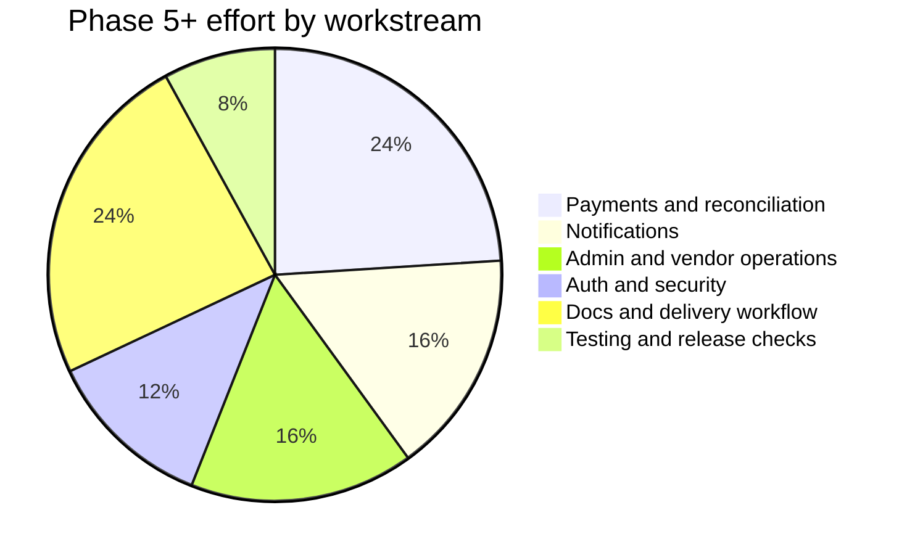

# Phase 5+ Client Recap

Period covered: April 14, 2026 to May 2, 2026

## Summary

The last few weeks moved SKIIP from a working pilot build toward a more launch-ready operating baseline. The main gains were around safer payments, clearer vendor and admin operations, stronger notification delivery, better release documentation, and more disciplined GitHub delivery tracking.

The most important May 2 outcome was closing the staging payment-pending issue. Paid orders now have stronger backend recovery paths through improved Stripe webhook handling and admin reconciliation support, reducing the risk that vendors see paid customer orders as still waiting for payment.

## Progress Timeline

## What Improved

| Area | Client-facing outcome |
| :--- | :--- |
| Payments | Stronger handling when Stripe succeeds but the app needs to reconcile order state. |
| Vendor operations | Vendors have clearer scheduled and active order visibility. |
| Admin operations | Store creation, status updates, archival, refunds, and reconciliation have stronger operator paths. |
| Notifications | Email and WhatsApp paths have richer provider handling and delivery tracking. |
| Delivery management | GitHub issues, milestones, labels, project status, release docs, and commit rules are clearer. |
| Testing | Public smoke tests, focused unit tests, and build/lint checks are now part of the working baseline. |

## Workstream Coverage

## Current Launch Position

The product app is in a stronger closed-pilot state, but it should not yet be treated as fully mainline-launch ready. The remaining gates are practical launch checks rather than broad rebuilds:

- environment and secret parity across Vercel, Supabase, Stripe, and notifications
- one complete Stripe payment, payout, refund, and reconciliation rehearsal
- one final scheduled-order paid lifecycle check through vendor status progression
- RLS/auth boundary sign-off
- legacy admin-store archive behavior fixed or documented with clear admin feedback
