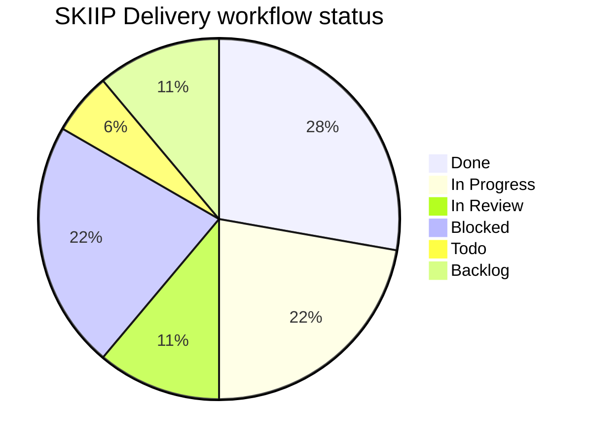
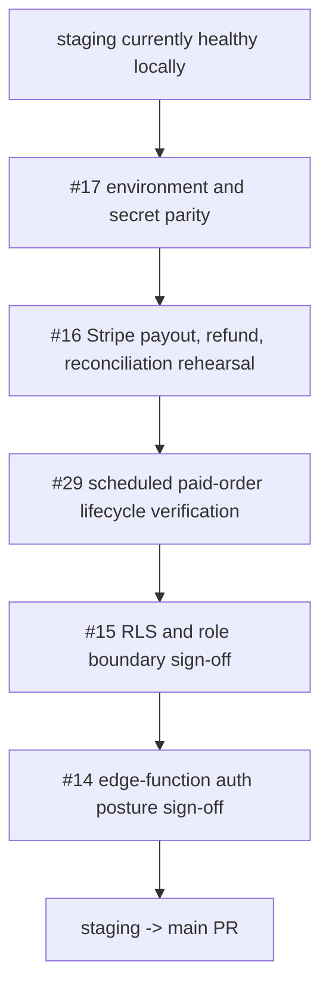

# Phase 5+ Internal Delivery Report

Period covered: April 14, 2026 to May 2, 2026

## Summary

Phase 5+ hardened the closed-pilot baseline across payments, order creation, admin/vendor operations, notifications, documentation, and GitHub delivery hygiene. Current `staging` is locally clean and aligned with `origin/staging` at `cee462f`.

The highest-value May 2 work was payment state recovery: retry-aware Stripe webhook processing, support for multiple webhook secrets, admin payment reconciliation, shared order/payment labels, and closure of the resolved vendor payment-pending bug `#32`.

## Delivery Snapshot

| Metric | Current value |
| :--- | :--- |
| Branch reviewed | `staging` |
| Current head | `cee462f chore: move archive docs to docs/archive and clean up root` |
| Phase 5+ commits ahead of `main` | 31 commits |
| GitHub issues tracked on board/list | 18 |
| Closed issues | 5 |
| Open issues | 13 |
| Open P0 issues | 5 |
| Local worktree before this docs change | clean |

## May 2 Commits

```text
cee462f - chore: move archive docs to docs/archive and clean up root
db5ca74 - fix(payments): support multiple Stripe webhook secrets
431152b - docs: add agent automation and commit standards
2ae1919 - Fix Stripe payment state recovery
```

## Issue Workflow Snapshot



| Workflow state | Issues |
| :--- | :--- |
| Done | `#20`, `#22`, `#24`, `#25`, `#32` |
| In Progress | `#17`, `#19`, `#27`, `#29` |
| In Review | `#14`, `#26` |
| Blocked | `#15`, `#16`, `#18`, `#23` |
| Todo | `#33` |
| Backlog | `#28`, `#34` |

## Verification

| Check | Result |
| :--- | :--- |
| `npm run test` | Passed, 22 tests |
| `npm run build` | Passed |
| `npm run lint` | Passed |
| `npm run test:e2e` | Passed 3 public smoke tests; 3 authenticated smoke tests skipped without credentials |

## Mainline Readiness

Do not push `staging` to `main` until these gates are closed:



Secondary cleanup before or immediately after mainline promotion:

- `#33`: fix legacy store archive failure through `admin-store`.
- `#23`: close only after `#33` is fixed or explicitly documented.
- `#19`: enable authenticated Playwright smoke checks with stable role credentials.
- `#18`: verify notification providers and backlog recovery operations.
- Close or supersede old audit PRs `#8` and `#9` before release hygiene is finalized.
