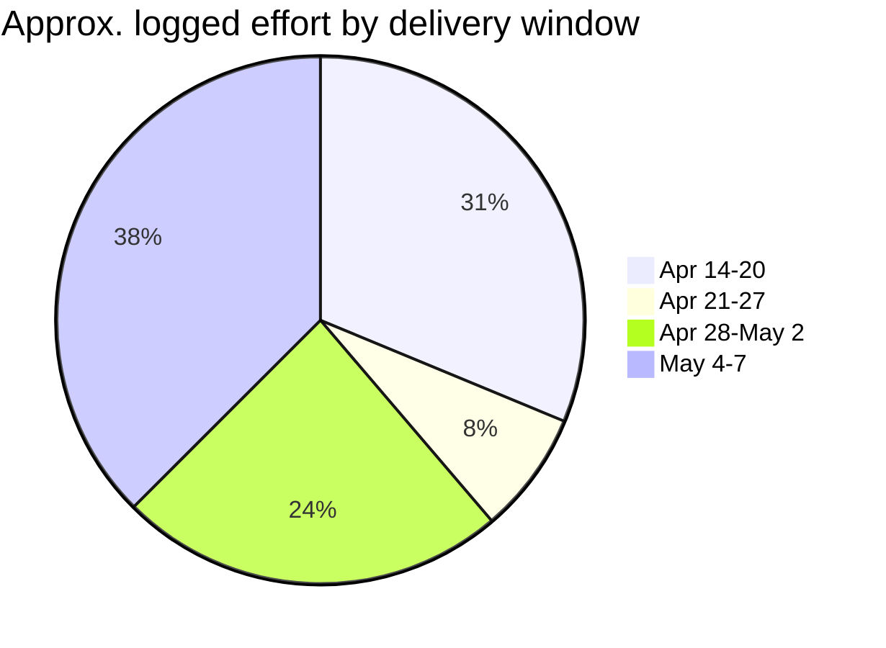
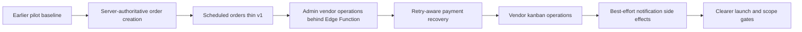
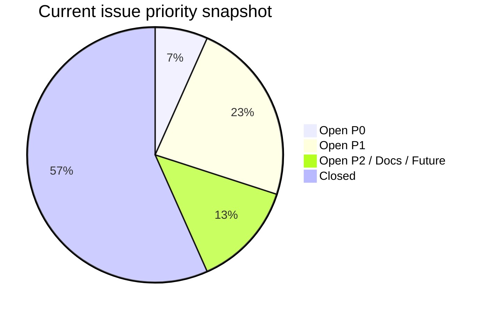

# Phase 5+ Momentum Update

Period covered: April 14, 2026 to May 7, 2026

## Summary

Phase 5+ has materially reduced SKIIP launch risk. The system moved from a promising pilot implementation toward a more operationally controlled product baseline with stronger payment recovery, server-mediated admin operations, scheduled-order support, a vendor kanban queue, notification hardening, release discipline, and clearer client-facing scope framing.

The key momentum signal is that the unresolved work is now concentrated. Earlier Phase 5 work fixed foundational product risks, and the May 4-7 work turned that into a cleaner launch-closeout posture: staging is at `v0.24.0`, 17 tracked issues are closed, only two P0 launch gates remain open, and the next phase can be framed as launch activation rather than unbounded feature building.

## Momentum By Window

| Window | Main progress |
| :--- | :--- |
| Apr 14-20 | Documentation reset, auth hardening, launch smoke checks, payment failure tracking, notification foundation. |
| Apr 21-27 | GitHub workflow setup, branching guidance, notification logging hardening, documentation maintenance. |
| Apr 28-May 2 | Atomic order creation, scheduled orders, admin vendor operations, payment recovery, delivery-board cleanup. |
| May 4-7 | Storage policy repair, Stripe Connect status reconciliation, checkout validation polish, staging readiness evidence, release/version sync, vendor kanban queue, best-effort notification queueing, seller-route guard, vendor card polish, scope/evolution docs. |

## Risk Reduction

| Risk area | Movement |
| :--- | :--- |
| Payment correctness | Stronger webhook idempotency, reconciliation fields, admin repair path, multi-secret webhook support, and Connect status repair. |
| Checkout experience | Structured inventory and Edge Function errors reduce generic failure states for buyers. |
| Operational control | Admin store operations, refunds, reconciliation, and vendor status management are less dependent on direct browser-side writes. |
| Vendor readiness | Scheduled orders, active/all filtering, kanban queue lanes, and polished order cards are now part of the launch baseline. |
| Notification reliability | Optional post-mutation queueing failures no longer cause successful order transitions, refunds, webhook completion, or reconciliation to be reported as failed. |
| Security/access | Seller route boundaries and protected edge-function behavior are clearer, with remaining hardening tracked explicitly. |
| Delivery hygiene | Versioning, release notes, issue hygiene, closeout logs, scope analysis, and project-evolution docs are stronger. |
| Launch safety | Remaining blockers are visible: provider parity, Stripe rehearsal, notification operations, authenticated smoke coverage, backend boundary hardening, and external launch sign-off. |

## Launch Readiness View

The trend is positive: earlier open P0s around auth posture, RLS/role boundaries, scheduled orders, Stripe onboarding return behavior, and vendor payment-pending state are now closed. The remaining P0s are both launch-activation gates rather than broad feature rebuilds:

- `#16`: Stripe payment, payout, refund, and reconciliation readiness.
- `#17`: environment and secret parity across hosted systems.

## Next Target

The next push should be verification-led, not feature-led:

1. Finish environment and secret parity checks.
2. Run the full Stripe payment, payout, refund, and reconciliation rehearsal.
3. Verify notification provider setup, webhooks, and retry/backlog ownership.
4. Enable authenticated Playwright smoke checks with stable buyer, seller, and admin credentials.
5. Complete backend boundary/security follow-through from `#28`, `#47`, and `#48`.
6. Decide which marketing-site lead-capture behavior is in or out of launch scope.
7. Prepare the next `staging -> main` release candidate once the live-environment gates are signed off.

## Scope Momentum

The project is now easier to explain commercially and operationally:

- **Delivered:** core buyer/vendor/admin flow plus significant Phase 5 hardening around payments, inventory, notifications, admin operations, auditability, release process, and docs.
- **Phase 6:** live provider setup, environment parity, Stripe rehearsal, notification verification, authenticated smoke tests, and launch support planning.
- **Phase 7+:** QR pickup, fuller event management, advanced analytics, multi-event expansion, production lead capture, broader account tooling, and major UI/product expansion.

That separation should keep the next phase grounded in launch readiness instead of letting post-launch expansion blur into the current closeout.
