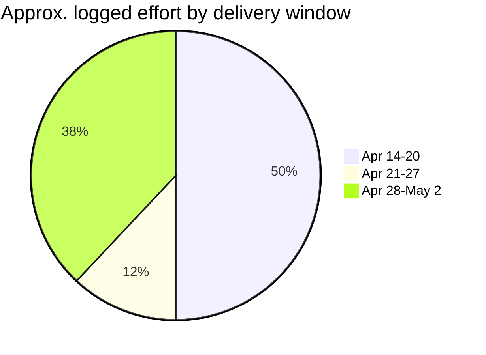
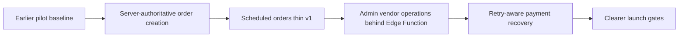
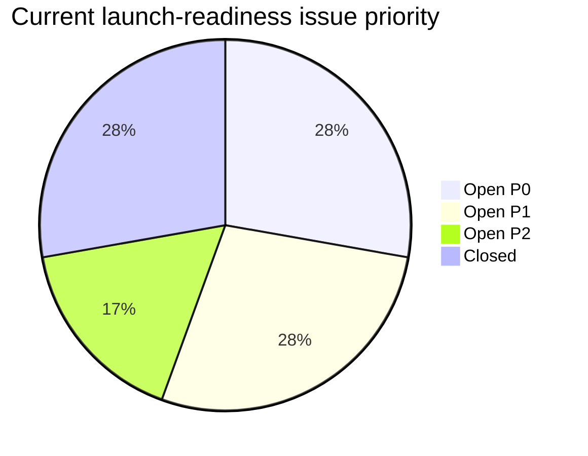

# Phase 5+ Momentum Update

Period covered: April 14, 2026 to May 2, 2026

## Summary

The past few weeks materially reduced SKIIP launch risk. The system moved from a promising pilot implementation toward a more operationally controlled product baseline with stronger payment recovery, server-mediated admin operations, scheduled-order support, notification hardening, and clearer release discipline.

The key momentum signal is that the most visible staging payment issue was resolved and closed. The remaining work is now concentrated around launch verification, provider parity, and controlled operational rehearsals.

## Momentum By Week

| Window | Main progress |
| :--- | :--- |
| Apr 14-20 | Documentation reset, auth hardening, launch smoke checks, payment failure tracking, notification foundation. |
| Apr 21-27 | GitHub workflow setup, branching guidance, notification logging hardening, documentation maintenance. |
| Apr 28-May 2 | Atomic order creation, scheduled orders, admin vendor operations, payment recovery, delivery-board cleanup. |

## Risk Reduction

| Risk area | Movement |
| :--- | :--- |
| Payment correctness | Stronger webhook idempotency, reconciliation fields, admin repair path, and multi-secret webhook support. |
| Operational control | Admin store operations and refunds are less dependent on direct browser-side writes. |
| Vendor readiness | Scheduled orders and clearer paid-order lifecycle visibility are now part of the launch baseline. |
| Delivery hygiene | Commit conventions, project board status, labels, milestones, and docs source-of-truth are stronger. |
| Launch safety | Remaining blockers are visible and concentrated in a small number of P0/P1 issues. |

## Launch Readiness View

## Next Target

The next push should be verification-led, not feature-led:

1. Finish environment and secret parity checks.
2. Run the full Stripe payment, payout, refund, and reconciliation rehearsal.
3. Verify one scheduled order through paid, preparing, ready, and collected.
4. Close or update the remaining auth/RLS and admin-store blockers.
5. Prepare a clean `staging -> main` PR once those gates are signed off.
